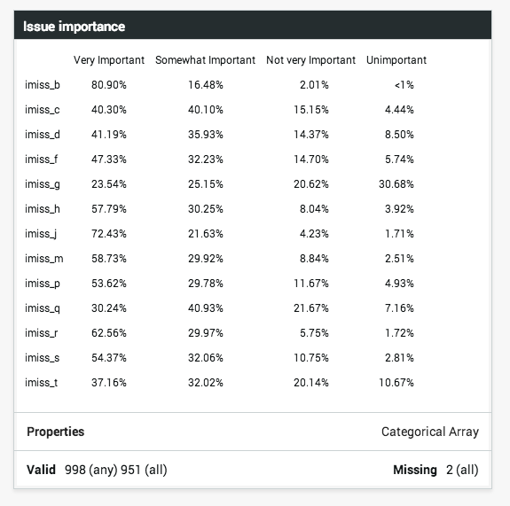

<!--
%\VignetteEngine{knitr::knitr}
%\VignetteIndexEntry{Array Variables}
-->

```{r, results='hide', echo=FALSE, message=FALSE}
library(rcrunch)
load("array-variables.RData")
```
# Array Variables

Sometimes variables' source datasets don't contain all of the metadata needed to create the more complex representations available in Crunch datasets. Plain-text .csv files, for example, can't express that some columns are actually indicator matrices of multiple selections (Multiple Response Variables). Most SPSS .sav files do not indicate Categorical Arrays (otherwise known as "grids") as being part of a group--they are simply several categorical variables. The same is true for an R `data.frame`.

## Creating an array

You can use rcrunch to "bind" categorical variables into Multiple Response and Categorical Array variables.

One of the reasons to use R with Crunch is to leverage the power of scripting for tasks that would be repetitive in a GUI. Many rcrunch functions operating on Crunch datasets have an optional `pattern` argument that lets you use regular expressions for these "bulk" operations. 

```{r, eval=FALSE}
grep("^imiss_", names(ds), value=TRUE)
```
```{r, echo=FALSE}
grep("^imiss_", names(start), value=TRUE)
```
```{r, eval=FALSE}
ds$imiss_b
```
```{r, echo=FALSE}
cat(show_imiss_b, "\n")
print(summary_imiss_b)
```
```{r, eval=FALSE}
ds$imiss <- makeArray(pattern="^imiss_", dataset=ds, name="Issue importance")
ds$imiss
```
```{r, echo=FALSE}
cat(show_imiss)
```
In the Crunch web application, the set of "important issue" variables have gone from thirteen separate categorical variable cards to just one, where the subvariables are shown as rows, and the common categories across all of them are shown as columns:



## Manipulating subvariables

```{r, eval=FALSE}
subvariables(ds$imiss)
```
```{r, echo=FALSE}
cat(show_imiss_subvars)
```
```{r, eval=FALSE}
ds$imiss$imiss_b
```
```{r, echo=FALSE}
cat(show_imiss_b, "\n")
print(summary_imiss_b)
```
```{r, eval=FALSE}
names(subvariables(ds$imiss))
```
```{r, echo=FALSE}
names_imiss_subvars
```
```{r, eval=FALSE}
names(subvariables(ds$imiss)) <- c("The economy", "Immigration", 
    "The environment", "Terrorism", "Gay rights", "Education", 
    "Health care", "Social security", "The budget deficit", 
    "The war in Afghanistan", "Taxes", "Medicare", "Abortion")
subvariables(ds$imiss)
```
```{r, echo=FALSE}
cat(show_imiss_subvars2)
```
```{r, eval=FALSE}
sorting <- order(names(subvariables(ds$imiss)))
subvariables(ds$imiss) <- subvariables(ds$imiss)[sorting]
subvariables(ds$imiss)
```
```{r, echo=FALSE}
cat(show_imiss_subvars3)
```

## Creating multiple response variables

```{r, eval=FALSE}
ds$boap_4
```
```{r, echo=FALSE}
cat(show_boap_4, "\n")
print(summary_boap_4)
```
```{r, eval=FALSE}
ds$boap <- makeMR(pattern="^boap_[0-9]+", dataset=ds, 
    name="Approval of Obama on issues", 
    selections=c("Strongly approve", "Somewhat approve"))
ds$boap
```
```{r, echo=FALSE}
cat(show_boap)
```

## (un)dichotomize
```{r, eval=FALSE}
ds$boap <- undichotomize(ds$boap)
ds$boap
```
```{r, echo=FALSE}
cat(show_boap2)
```
```{r, eval=FALSE}
ds$boap <- dichotomize(ds$boap, "Strongly approve")
ds$boap
```
```{r, echo=FALSE}
cat(show_boap3)
```
## Splitting arrays back into categoricals

```{r}
grep("boap", names(ds), value=TRUE)
```
```{r, eval=FALSE}
unbind(ds$boap)
ds <- refresh(ds)
```
```{r, results='hide', echo=FALSE, message=FALSE}
ds <- start
```
```{r}
grep("boap", names(ds), value=TRUE)
```