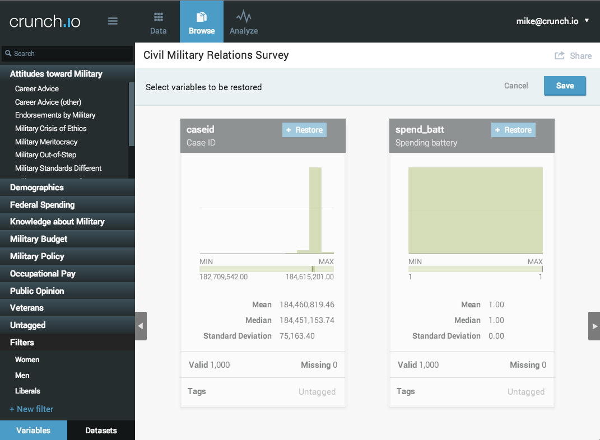
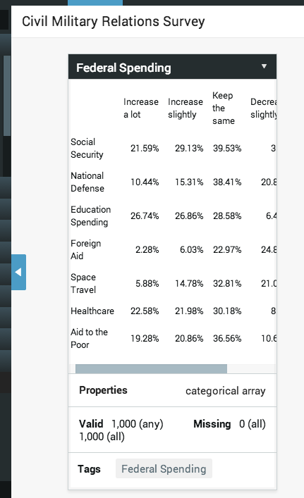

<!--
%\VignetteEngine{knitr::knitr}
%\VignetteIndexEntry{Getting Started with RCrunch}
-->

# Crunch and RCrunch basics

Crunch is a cloud-based data store and analytic engine. It has a web client for doing the most common analytic tasks, allowing analysts and clients to see their data and interact with it. Most of the time, clients will use the web client to explore data, quickly making tables and graphs, filters and subsets. The *rcrunch* package for R allows analysts to interact with and manipulate Crunch datasets from within R.

```{r, message=FALSE}
library(rcrunch)
```

## The Crunch API

Both *rcrunch* and the Crunch web application talk to the same Crunch Application Programming Interface (API). Within an R script or interactive session, the rcrunch package is designed to make interacting with your data in Crunch into idiomatic R.

The Crunch API is served over secure http, and uses [Shoji](https://bitbucket.org/fumanchu/shoji/src), a way to structure APIs with JSON. When you call rcrunch functions, they'll take care of using [httr](https://github.com/hadley/httr) (which wraps [RCurl](http://www.omegahat.org/RCurl/)), and API responses are turned into R objects. Some functions act more like commands, such as `login()`, but its side effects are documented in the regular package documentation.

## Accounts

*Important: authentication to crunch.io with a username and password will change*

The first step after loading the rcrunch package is to log in:
```{r, eval=FALSE}
login(email="xkcd@crunch.io", password="correct horse battery staple")
```
```
## Logged into crunch.io as xkcd@crunch.io
```

```{r, results='hide', echo=FALSE, message=FALSE}
## The vignette is designed to be run at package build time against localhost with nonsecure credentials!
options(crunch.api="http://localhost:8080/api/")
login("***REMOVED***", "***REMOVED***")
```

This will log you in to the crunch API. All of these parameters can be also be set as R `options` so you can simply `login()`.

## Datasets and Variables

The Crunch data store is built around datasets, which contain variables. Unlike R data.frames and atomic vectors, Crunch datasets and variables have a lot of metadata. This vignette is going to use rcrunch to manipulate a dataset, alongside an instance of the same dataset in the web client. Many of the operations can be done with either client, but might be faster or easier to automate with R. 

# Adding datasets to Crunch

## Via the web client

In the web application, click *Import Data* and upload either a .csv or an SPSS .sav file. 


Since the dataset is loaded as soon as it's uploaded, we can go ahead and change its name on the web client before connecting with rcrunch.


## Adding datasets with rcrunch

Of course, you can also create datasets with rcrunch. There are two methods:

### 1. newDatasetFromFile

`newDatasetFromFile` essentially does what you would do in the web application: uploads your file and creates a dataset from it.

```{r}
ds <- newDatasetFromFile("PLMX0151ZBHD_OUTPUT.sav", name="Civil Military Relations Survey")
```
```{r echo=FALSE, warning=FALSE, message=FALSE}
## Enable the fiction that we have loaded data via whaam
plmx <- loadDataset("Civil Military Relations Survey")
```

### 2. newDataset

Alternatively, you can create a dataset from any `data.frame` you have in your R session:

    library(foreign)
    df <- read.spss("PLMX0151ZBHD_OUTPUT.sav")
    ds <- newDataset(df, name="Civil Military Relations Survey")

# Loading Crunch datasets into rcrunch

Datasets already existing on the Crunch server can be loaded by name or by position within the dataset list using `loadDataset`:

```{r}
listDatasets()
(ds <- loadDataset("Civil Military Relations Survey"))
```

# Manipulating datasets

From here, we can set a number of dataset properties, such as toggling a weight variable, changing the name or adding a description, from within R and our changes are carried out on the Crunch dataset.

> Note: sometimes changes from rcrunch are applied to the remote dataset but not immediately reflected in the rcrunch environment. As the package develops, these 'sync hiccups' should be smoothed out.
> For example, because rcrunch attaches to datasets by their name, changing their name requires a call to `updateDatasetList()` before `loadDataset` on the new name.

## Hide Variables

Datasets often contain variables that you may want to use -- perhaps through a derived variable, a transformation (or recode) -- or simply not be relevant for the analytic tasks at hand. In short, you want to hide them. Of course they are never deleted, but they no longer clutter the dataset "workspace" 

As with a typical R data.frame, you typically assign the return of a dataset-level function back to the variable representing the dataset in your R script or session. As with the `is.na` function, you can update a variable by assigning it to the hidden variables list.

```{r hide-variables}
ds <- hideVariables(ds, 'caseid')
hiddenVariables(ds)
hiddenVariables(ds) <- 'spend_Batt'
hiddenVariables(ds)
```



These variables are now hidden in the application. And, just as you could restore them there, you can also restore them from R:

```{r unhide}
ds <- unhideVariables(ds, 'caseid')
hiddenVariables(ds)
```

## Create Array Variables

Sometimes variables' source datasets don't contain all of the metadata needed to create the more complex representations available in Crunch datasets. Plain-text .csv files, for example, can't express that some columns are actually indicator matrices of multiple selections (Multiple Response Variables). Most SPSS .sav files do not indicate Categorical Arrays (otherwise known as "grids") as being part of a group--they are simply several categorical variables--and the format does not support non-categorical numeric-valued arrays that are sometimes used in surveys for ratings or 'thermometer' type responses.

You can use rcrunch to "bind" Multiple Response and Categorical Arrays into a Crunch array variable.

One of the reasons to use R with Crunch is to borrow the power of scripting for repetitive tasks. Hiding variables by regular expression is an obvious use case for datasets with a number of variables that are important to the data but not used for most analytic tasks. Most R functions that work on Crunch datasets have an optional `pattern` argument that lets you use regular expressions for these "bulk" operations. Having hidden the constant `spend_Batt`, we can now group the other `spend_` variables into a Categorical Array.

```{r bind}
(spending <- makeArray(pattern="^spend_", dataset=ds, name="Federal Spending"))
```

In the Crunch web application, the Federal Spending array has gone from seven separate categorical variable cards to just one, where the subvariables are shown as rows, and the common categories across all of them are shown as columns:




```{r, results='hide', echo=FALSE, message=FALSE}
## teardown
delete(ds)
logout()
```
