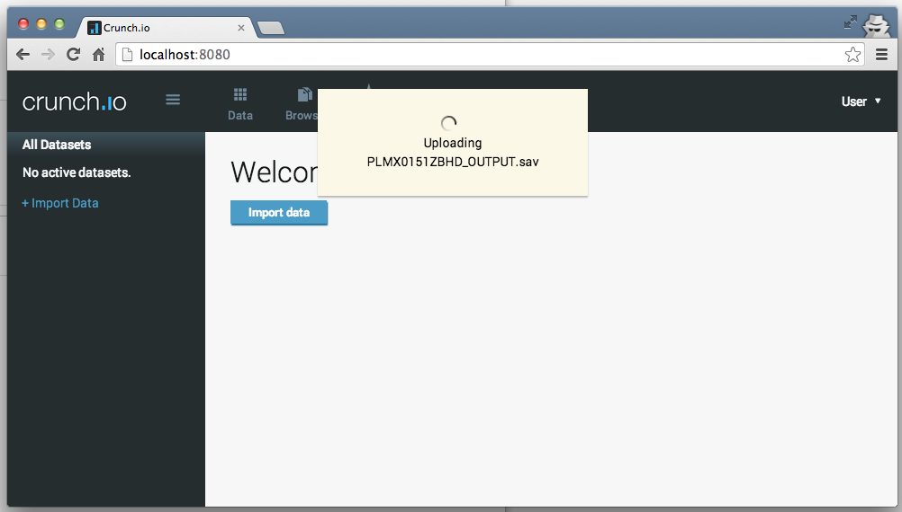
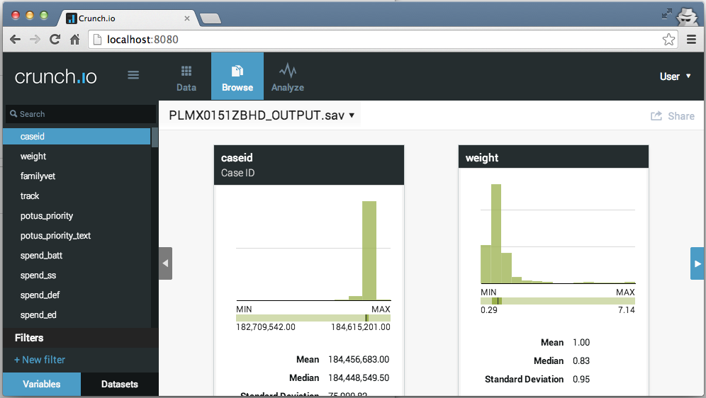
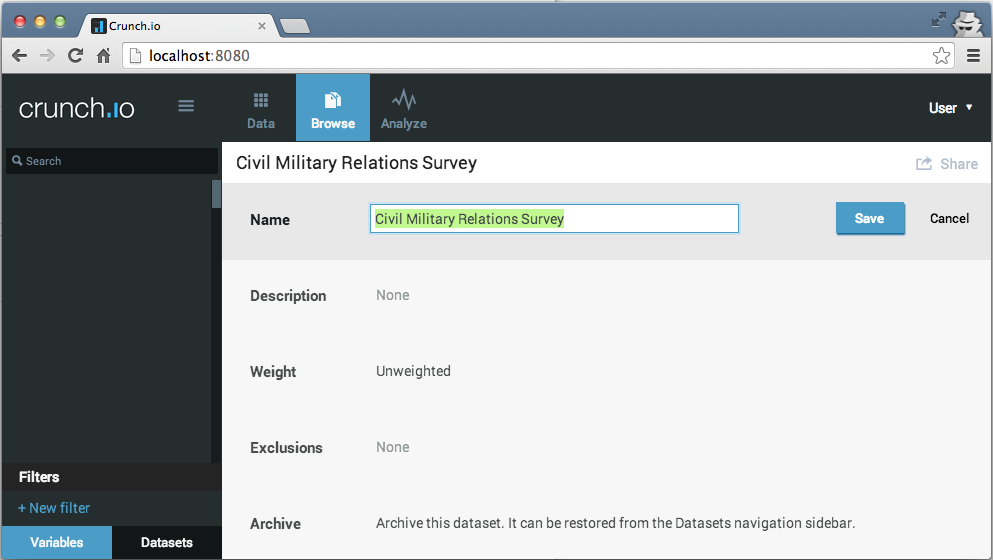

<!--
%\VignetteEngine{knitr::knitr}
%\VignetteIndexEntry{Getting Started with RCrunch}
-->

# Crunch and RCrunch basics

Crunch is a cloud-based data store and analytic engine. R is a programming language (technically the language is S, but the R dialect has eclipsed the commercial S-Plus implementation) and an interactive desktop environment for using the language.

Crunch also has a web client for doing the most common analytic tasks, allowing analysts and clients to see their data and interact with it. Most of the time, clients will use the web client to explore data, quickly making tables and graphs, filters and subsets. 

```{r, message=FALSE}
library(rcrunch)
```

## The Crunch API

Both *rcrunch* and the Crunch web application talk to the same Crunch Application Programming Interface. Within an R script or interactive session, the rcrunch package is designed to make interacting with your data in Crunch into idiomatic R.

The Crunch API is served over secure http, and uses [Shoji](https://bitbucket.org/fumanchu/shoji/src), a way to structure APIs with JSON. When you call most rcrunch functions, they'll take care of using [httr](https://github.com/hadley/httr) or [RCurl](http://www.omegahat.org/RCurl/), and in general API results are turned into R objects. Some functions act more like commands, such as `login()`, but its side effects are documented in the regular package documentation.

## Accounts

*Important: authentication to crunch.io with a username and password will change*

The first step after loading the rcrunch package is to log in:
```{r, eval=FALSE}
login(email="xkcd@crunch.io", password="correct horse battery staple")
```
```
## Logged into crunch.io as xkcd@crunch.io
```

```{r, results='hide', echo=FALSE, message=FALSE}
## The vignette is designed to be run at package build time against localhost with nonsecure credentials!
options(crunch.api="http://localhost:8080/api/")
login("***REMOVED***", "***REMOVED***")
```

This will log you in to the crunch API. All of these parameters can be also be set as R `options` so you can simply `login()`.

## Datasets and Variables

The Crunch data store is built around datasets, which contain variables. Unlike R data.frames and atomic vectors, Crunch datasets and variables have a lot of metadata. This vignette is going to use rcrunch to manipulate a dataset, alongside an instance of the same dataset in the web client. Many of the operations can be done with either client, but might be faster or easier to automate with R. 

# Adding datasets to Crunch

The easiest way to add data is through the web client. Just click *Import Data* and upload either a csv or an spss sav file. 




Since the dataset is loaded as soon as it's uploaded, we can go ahead and change its name on the web client before connecting with rcrunch.



## Adding datasets with rcrunch

Of course, you can also upload datasets with rcrunch.

```{r}
ds <- newDatasetFromFile("PLMX0151ZBHD_OUTPUT.sav")
```
```{r echo=FALSE, warning=FALSE, message=FALSE}
plmx <- loadDataset("PLMX0151ZBHD_OUTPUT.sav")
delete(plmx)
```

# Loading Crunch datasets into rcrunch

```{r}
listDatasets()
(ds <- loadDataset("Civil Military Relations Survey"))
```

# Manipulating datasets

## Tagging Variables

## Hide Variables

## Create Array Variables

