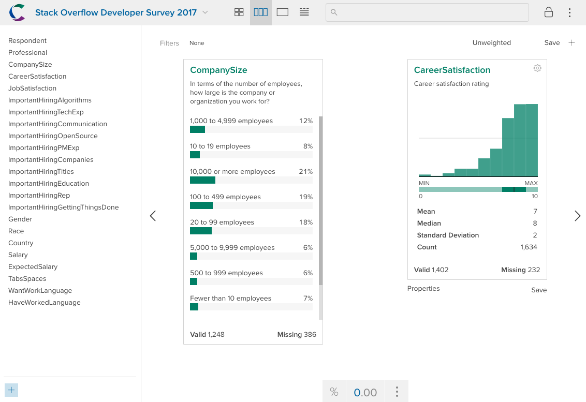
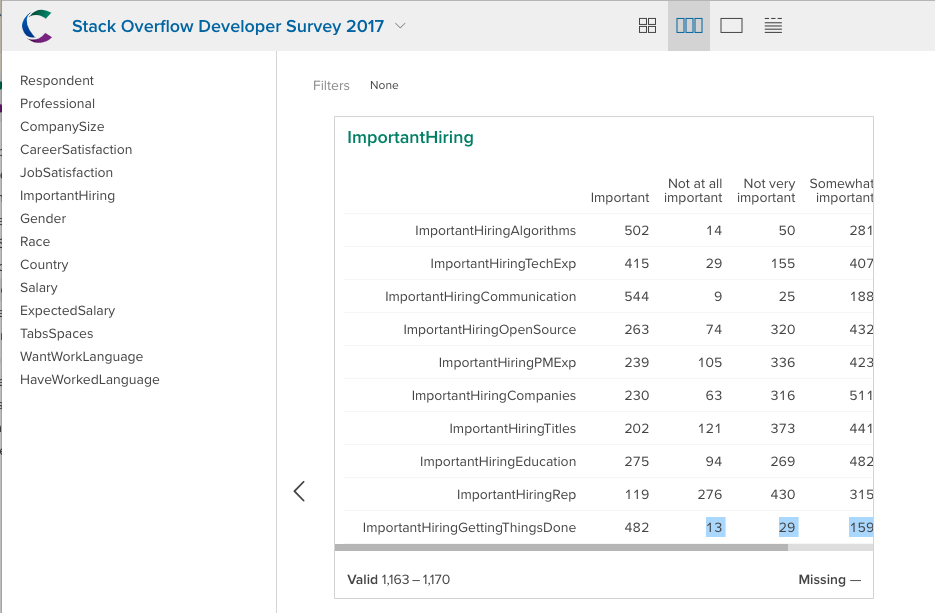
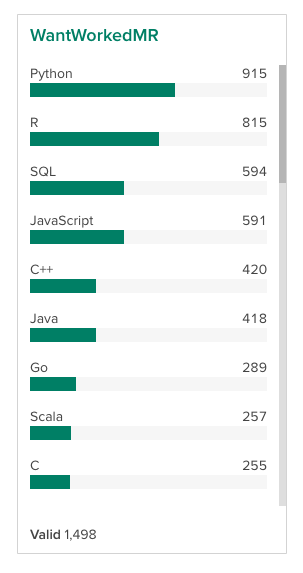

[Crunch.io](http://crunch.io/) provides a cloud-based data store and analytic engine. It has a [web client](https://app.crunch.io/) for interactive data exploration and visualization. The **crunch** package for R allows analysts to interact with and manipulate Crunch datasets from within R. Importantly, this allows technical researchers to collaborate naturally with team members, managers, and clients who prefer a point-and-click interface. Because every user connects to the same dataset in the cloud, there is no need to email files back and forth continually to share results.

```{r, message=FALSE}
library(crunch)
```

```{r, results='hide', include = FALSE}
library(httptest)
clean_up <- envOrOption("clean.up.vignette.generation", TRUE) # Whether to delete datasets 
start_vignette("crunch")
login()
```

Both **crunch** and the Crunch web application communicate with the same application programming interface (API), served over secure HTTP. Within an R script or interactive session, the **crunch** package allows you to interact with your data in Crunch with expressive, idiomatic R. Functions in crunch handle the translation between R objects and API requests and responses, so you can typically interact with your datasets as if they were local `data.frames` (with some additional metadata), not data on a remote server.

## Authentication

All work with data in Crunch requires authentication. Thus, the first step after loading the **crunch** package is to log in. In an interactive R session, provide the email address associated with your Crunch account, and you will be prompted to give your password safely:

```{r login, eval=FALSE}
login("xkcd@crunch.io")
```
```
Crunch.io password for xkcd@crunch.io: *enter your password here*
## Logged into crunch.io as xkcd@crunch.io
```

If you use an OAuth provider, such as Google, to log into the Crunch web application, you'll need to first set a Crunch password for use here. Do `resetPassword("xkcd@crunch.io")` with your email address, and you'll receive an email with password setting instructions.  

Your email and Crunch password can be set either as R `options` in your .Rprofile (`crunch.email` and `crunch.pw`) or as environment variables (`R_CRUNCH_EMAIL` and `R_CRUNCH_PW`) so that you can simply `login()`. See `?login` for details.

## Datasets

The Crunch data store is built around datasets, which contain variables. Crunch datasets and variables include more metadata than R `data.frames` and `vectors` and if possible the functions and methods in **crunch** work to keep all of the data on the server, only pulling metadata and aggregations when requested. That way, you can explore datasets much larger than you can comfortably load on your laptop.

To get started, we're going to import a dataset from R to Crunch. If you already have a dataset---perhaps someone has invited you to collaborate on one already---see `listDatasets()` or `loadDataset()` for information on how to find and load it.

## Importing data to Crunch

There are multiple ways to create a new dataset. In the web application, you can upload files to create datasets using the file loader. From **crunch**, there are two methods for creating datasets: one for `data.frames` and one for files of other (non-R) formats.

We've included with the package a sample from the [2017 Stack Overflow developer survey](https://insights.stackoverflow.com/survey/) which is filtered on those respondents who reported having been R users and selecting a handful of variables.

```{r dimensions}
dim(SO_survey)
```

You can create a dataset from any `data.frame` you have in your R session with `newDataset`. Let's use that sample dataset:

```{r load dataset, message=FALSE}
ds <- newDataset(SO_survey, name="Stack Overflow Developer Survey 2017")
dim(ds)
```

`newDataset` takes a `data.frame` as it's input and translates R data types into their analogous types in Crunch.

* character --> Text Variable
* numeric, integer --> Numeric Variable
* factor --> Categorical Variable
* Date --> Datetime Variable

If you have an SPSS or CSV file, you can upload it with that without first reading it into R by giving `newDataset` the file name or URL. In this case, it essentially does what you would do in the web application: uploads your file and creates a dataset from it.

<!-- TODO: host that CSV on our website, give example -->

## Dataset properties

Datasets allow you to provide a human-readable `name` is specified when the dataset is uploaded, and a `description`.

```{r get dataset description}
name(ds)
description(ds)
```

Both can be set with `<-` assignment. Let's give our dataset an informative description:

```{r state change2, include=FALSE}
change_state()
```

```{r set description}
description(ds) <- "Subset of the main survey, restricted to self-reported R users"
description(ds)
```

## Variables

Just as a `data.frame` has columns you can access with the `$` and `[` operators, you can get variables from a Crunch dataset the same way.

```{r variable examples}
ds$TabsSpaces
ds[, "CompanySize"]
```

The **crunch** package aims to bring the minimum amount of data down from the server. Most methods work by calculating values on the server, and then transmitting the results to you R session instead of transmitting all the data. In this case, the server calculates and transmits the variable summary instead of sending the data. If you ever want to actually access the data in the variable, you can call `as.vector(var)` to pull down its column.

Crunch allows you to store additional metadata about the variables that R doesn't support. For instance, we can add the survey question wording as the "description" for each variable. This question wording is available in the schema file that comes with the Stack Overflow dataset, in the "Question" column.

```{r state change3, include=FALSE}
change_state()
```

```{r variable descriptions}
descriptions(variables(ds)) <- SO_schema$Question
description(ds$CompanySize)
```

Since the R package and the web app use the same API to interact with Crunch datasets, you can go back and forth between viewing data in R and on the web. For convenience, the package includes a `webApp()` function, which opens a dataset or a variable within a dataset in your browser in the web application.

```{r open variable, eval = FALSE}
webApp(ds$CompanySize)
```
```{r open variable screen, echo = FALSE}

```

## Array Variables

Crunch is designed for survey data, and it includes native support for two data structures common in survey data: categorical arrays (or "grids") and multiple response. In R, these would typically be represented either as multiple, separate columns in a `data.frame` or as some other data structure that needs processing before you can analyze it. Crunch makes it so you don't have to think about the underlying data structures in order to do exploratory analysis.

#### Categorical Arrays

Surveys commonly ask sets of related questions. In the Stack Overflow survey, there are several questions about the importance of various factors for hiring. Conceptually these questions go together, but because of the limitations of storing data in a table they are presented as separate variables.

```{r categorical arrays}
ds$ImportantHiringCompanies
ds$ImportantHiringAlgorithms
```

Crunch allows you to bundle these related questions together into a _Categorical Array_. This is immensely useful when you want to analyze or communicate information about the set of questions. You can use the whole array in a cross-tab without having to process dozens of individual variables.

To create a Categorical Array variable from R, we can use the `makeArray` function. We'll pass to that function a selection of variables to bind together into an array, along with any additional metadata we want to provide. Fortunately here, the variables we want to select have a common naming convention, so we can `grep` for them:

```{r grep subvars}
imphire <- grep("^ImportantHiring", names(ds), value = TRUE)
imphire
```

Now we can use that selection in `makeArray`:

```{r state change4, include=FALSE}
change_state()
```
```{r makeArray}
ds$ImportantHiring <- makeArray(ds[imphire], name = "Importance in Hiring Process")
```

The variables we included in the array have been converted into subvariables of the categorical array, and are still accessible using the `subvariables()` function.

```{r}
subvariables(ds$ImportantHiring)
```

Those names aren't that pretty. As we saw above, though, we have better names for them appended to the question wording we read in from the schema. Each subvariable `description` has the full question wording, which really should be the `description` of the parent array variable, and then after the question mark, the response label.

Let's use some regular expressions to clean that up. We can pull the part before the question mark from one of the subvariables and add that to the parent, and then prune the question wording from all and use that as the "names":

```{r state change5, include=FALSE}
change_state()
```
```{r}
description(ds$ImportantHiring) <- sub("^(.*\\?).*$", "\\1",
    descriptions(subvariables(ds$ImportantHiring))[1])
names(subvariables(ds$ImportantHiring)) <- sub("^.*\\? (.*)$", "\\1",
    descriptions(subvariables(ds$ImportantHiring)))

subvariables(ds$ImportantHiring)
```

```{r View array, eval = FALSE}
webApp(ds$ImportantHiring)
```
```{r View array screen, echo = FALSE}

```

#### Multiple Response

Crunch also has a special variable type for multiple-response data. These are survey questions that give users a set of options and allow them to select more than one of them. An example of this from the Stack Overflow survey is asking which language a respondent wanted to work with. In this dataset, the responses are stored in a single column with each language delimited by semicolon:

```{r}
knitr::kable(SO_survey[1:5, "HaveWorkedLanguage", drop = FALSE], row.names = FALSE)
```

To analyze this data without Crunch you would usually go through an elaborate data cleaning process to split the delimited variable up into its constituent parts, and then reshape it into a format which is more amenable to analysis. With Crunch, you can make use of multiple response variables to store it in a compact form, and analyze it just like any other variable. Since delimited text is such a common way of storing this kind of answer, Crunch allows you to create a variable directly from the text. This function creates a _derived variable_, which means that if you make changes to the data in the initial variable, the derived variable will change along with it.

```{r state change6, include=FALSE}
change_state()
```
```{r makeMRFromText}
ds$WantWorkLanguageMR <- makeMRFromText(ds$WantWorkLanguage,
    delim = "; ",
    name = "Languages Desired for Work",
    description = description(ds$WantWorkLanguage))
```

To see what this looks like, let's do a simple `table()` of the new variable and see the counts:

```{r MR table}
table(ds$WantWorkLanguageMR)
```

Since this is multiple-response data, the sum of these numbers may be bigger than the number of respondents because people were allowed to select more than one.

We can reorder the subvariables to make this card easier to read. Let's sort them by frequency.

```{r reorder subvariables}
counts <- sort(table(ds$WantWorkLanguageMR), decreasing = TRUE)
subvariables(ds$WantWorkLanguageMR) <- subvariables(ds$WantWorkLanguageMR)[names(counts)]
```

```{r echo = FALSE}

```

#### Conclusion

This vignette has gone through some of the basics of working with crunch in R including loading data, manipulating dataset properties, and creating array variables. The **crunch** package provides an extensive set of tools for working with survey data and nearly everything that can be done in the crunch web app can be accomplished programmatically using R. To learn more about specific use cases, check out some of the other articles:


```{r, include=FALSE}
logout()
if (clean_up) {
  try(with_consent({
    delete(ds)
  }), silent = TRUE)
}
end_vignette()
```

* [Variables](variables.html): cleaning and defining variable metadata
* [Array variables](array-variables.html): how to create and manipulate categorical-array and multiple-response variables
* [Variable organization](variable-order.html): defining a hierarchy and arranging variables within it
* [Transformations and derivations](derive.html): alter values within a dataset and create new variables as a function of others
* [Computing on Crunch data](analyze.html): crosstabbing and more
* [Filtering](filters.html): subsetting data, both in your R session and in the web interface
* [Downloading and exporting](export.html): how to pull data from the server, both for use in R and file export
* [Subtotals and headings](subtotals.html): how to set and get subtotals and headings for categorical variables
* [Crunch internals](crunch-internals.html): an introduction to the Crunch API and concepts to help you make more complex and more efficient queries
* [Category objects](abstract-categories.html): an introduction to the S4 classes that power categories and category-like representations in the package
