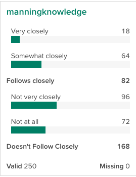

```{r load data, include=FALSE}
## Because the vignette tasks require communicating with a remote host,
## we do all the work ahead of time and save a workspace, which we load here.
## We'll then reference saved objects in that as if we had just retrieved them
## from the server
library(crunch)
load("vignettes.RData")
options(width=120)
```

A common task in the Market research world is to collapse two or more categories together to see how the collapsed categories compare to one another. For example, if you asked people to rate their preference on a scale of 1-10 you might want to see how the people who provide a rating between 1 and 5 compare to those who rated it between 6 and 10. This goes by a number of names like _Top Box_, _Top Two Box_, or _Nets_. But in Crunch it is called _Subtotals_

Subtotals can be applied to any Categorical Crunch Variables, and we can check if a variable has subtotals with the `subtotals()` function. If it returns `NULL`, there are no subtotals.

```{r no subtotals, eval=FALSE}
subtotals(ds$obamaapp)
```
```{r no subtotals print, echo = FALSE}
sub_initial_subtotals
```

To add subtotals, we can save a list of `Subtotal` objects. Each `Subtotal` object has three things:

* `name` the label to identify the subtotal
* `categoires` the categories to add subtotal (here you can use either category names or category ids)
* `after` the category that the subtotal should follow (again, either category names or category ids)

```{r add some subtotals, eval = FALSE}
subtotals(ds$DiversityImportant) <- list(
    Subtotal(name = "Follows closely",
             categories = c("Strongly closely", "Very closely"),
             after = "Somewhat closely"),
    Subtotal(name = "Generally disagree",
             categories = c("Not very closely", "Not at all"),
             after = "Not at all")
)
```

Now, if we check `subtotals()`, we can see that we have saved them. In this output we see a few different aspects of subtotals: the `anchor` is the id of the category to put the subtotal after (matching the `after` argument in `Subtotal()`), name, aggregation functions and `args` which in the this case are the category ids to include in the subtotal.

```{r new subtotals, eval = FALSE}
subtotals(ds$manningknowledge)
```
```{r, echo = FALSE}
sub_subtotals1
```

This shows up in the Categorical variable car like so: 

```{r crunch app output, echo = FALSE}
 

```

Now that we have seen how to add subtotals, let's look at headings. Headings are similar to subtotals in that they are additions to categorical variables that will be displayed in the app. For a categorical with many categories, they can help group variables visually (without adding a subtotal). Here we add some guides to Obama's approval rating. 

```{r add some headings, eval = FALSE}
subtotals(ds$obamaapp) <- list(
    Heading(name = "Approves",
            after = 0),
    Heading(name = "Disapprove",
            after = "Somewhat Approve"),
    Heading(name = "No Answer",
            after = "Strongly Disapprove")
)

subtotals(ds$obamaapp)
```
```{r headings out, echo = FALSE}
sub_headings
```

# Removing subtotals
Subtotals and headings can be removed by assigning a `NULL` value. 
```{r remove some headings, eval = FALSE}
subtotals(ds$YearsCodedJob) <- NULL
```
```{r remove headings out, echo = FALSE}
sub_initial_subtotals
```

# Setting many subtotals 

In the Economist survey, there are a number of questions that have the same response categories. If the category names (or ids, if we're using those) are the same, we can use the same set of subtotals across multiple variables.
```{r save some subtotals, eval = FALSE}
approve_subtotals <- list(
    Subtotal(name = "Approves",
            categories = c("Somewhat approve", "Strongly approve"),
            after = "Somewhat approve"),
    Subtotal(name = "Disapprove",
            categories = c("Somewhat disapprove", "Strongly disapprove"),
            after = "Strongly disapprove"))
```

```{r check some categories, eval = FALSE}
subtotals(ds$snowdenleakapp) <- approve_subtotals
subtotals(ds$congapp) <- approve_subtotals
```

Notice here, because each of the categories for these variables has slightly different ids, the `args` in the output differs slightly. But, because we used category names when we were constructing our list of subtotals, when we store them on the variable itself Crunch does the right things and converts them over to the correct ids.

```{r show some categories, eval = FALSE}
subtotals(ds$snowdenleakapp)
subtotals(ds$congapp)
```
```{r show categories out, echo = FALSE}
sub_snowdon
sub_con
```

