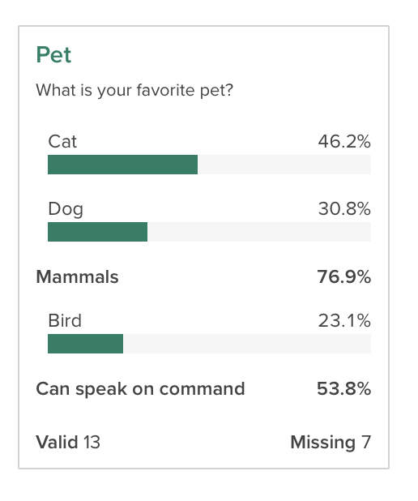

```{r, message=FALSE}
library(crunch)
```

[Previous: exporting data](export.html)
```{r, results='hide', include = FALSE}
set_crunch_opts("crunch.api" = "https://app.crunch.io/api/")
options(width=120)
library(httptest)
if (!dir.exists("subtotals")) {
    login()
    
    if ("example vignette ds - subtotal" %in% listDatasets()) {
        ds <- loadDataset("example vignette ds - subtotal")
        with_consent(deleteDataset("example vignette ds - subtotal"))
    }
    
    ds <- newExampleDataset()
    name(ds) <- "example vignette ds - subtotal"
    lvls <- c("Love", "Like", "Neutral", "Dislike", "Hate")
    ds$like_dogs <- factor(rep(lvls, c(4, 4, 8, 2, 2)), lvls)
    ds$like_cats <- factor(rep(lvls, c(3, 5, 1, 6, 5)), rev(lvls))
    
    httpcache::clearCache()
}
start_vignette("subtotals")
ds <- loadDataset("example vignette ds - subtotal")
```

A common task in the market research world is to collapse two or more categories together to see how the collapsed categories compare to one another. For example, if you asked people to rate their preference on a scale of 1 to 10, you might want to see how the people who provide a rating between 1 and 5 compare to those who rated it between 6 and 10. This goes by a number of names, including "_Top Box_" or "_Nets_", depending on the use case. In Crunch, we call this family of features _Subtotals_. This vignette shows how to define, manage, and analyze variables with subtotals.

# Getting and setting subtotals on a categorical variable

Subtotals can be applied to any Categorical or Categorical Array variable. In R, we can view and set subtotal definitions with the `subtotals()` function. If there are no subtotals, the function will return `NULL`:

```{r no subtotals}
subtotals(ds$q1)
```

To add subtotals, we can assign a list of `Subtotal` objects. Each `Subtotal` object has three things: a `name` to identify it; a set of `categories` to pool together, referenced either by category name or id; and a location to show it, either `after` a given category or with `position="top"` or `"bottom"` to pin it first or last in the list.

```{r state change1, include=FALSE}
change_state()
```

```{r add some subtotals}
subtotals(ds$q1) <- list(
    Subtotal(
        name = "Mammals",
        categories = c("Cat", "Dog"),
        after = "Dog"
    ),
    Subtotal(
        name = "Can speak on command",
        categories = c("Dog", "Bird"),
        after = "Bird"
    )
)
```

```{r state change2, include=FALSE}
change_state()
```


Now, if we check `subtotals()`, we can see that we have saved them. In this output we see a few different aspects of subtotals: the `anchor` is the id of the category to put the subtotal after (matching the `after` or `position` argument in `Subtotal()`), name, aggregation functions and `args`, which in the this case are the category ids to include in the subtotal.

```{r new subtotals}
subtotals(ds$q1)
```

This shows up in the Categorical variable card on the web app like this:

```{r crunch app output, echo = FALSE}

```

Crunch also supports "Subtotal Differences" (sometimes also called "Net Promoter Scores"\u2122). The `negative` argument of `Subtotal` specifies which categories to subtract.

```{r add subtotal diff}
subtotals(ds$like_dogs) <- list(
    Subtotal(
        name = "Love minus Dislike & Hate",
        categories = c("Love"),
        negative = c("Dislike", "Hate"),
        position = "top"
    )
)
```

# Subtotals on multiple response variables

[Multiple Response variables](array-variables.html) can also have subtotals. To specify, use the alias or name of the subvariables as the categories.

```{r add mr subtotal}
subtotals(ds$allpets) <- list(
    Subtotal(
        name = "Any mammal",
        c("allpets_1", "allpets_2"),
        position = "top"
    )
)
```

```{r state change3, include=FALSE}
change_state()
```

# Removing subtotals

Subtotals and headings can be removed by assigning a `NULL` value.

```{r remove some headings}
subtotals(ds$like_dogs) <- NULL
```

# Setting many subtotals

Sometimes there are a number of questions that have the same response categories. If the category names (or ids, if we're using those) are the same, we can use the same set of subtotals across multiple variables.

```{r save some subtotals}
pet_type_subtotals <- list(
    Subtotal(
        name = "Love minus Dislike & Hate",
        categories = c("Love"),
        negative = c("Dislike", "Hate"),
        position = "top"
    )
)
```

```{r check some categories}
subtotals(ds$like_dogs) <- pet_type_subtotals
subtotals(ds$like_cats) <- pet_type_subtotals
```

Notice here, because each of the categories for these variables has slightly different ids, the `args` in the output differs slightly. But, because we used category names when we were constructing our list of subtotals, when we store them on the variable itself, Crunch does the right thing and converts them over to the correct ids.

```{r show some categories}
subtotals(ds$like_dogs)
subtotals(ds$like_cats)
```


# Computing with subtotals

Now that we have defined subtotals on the congressional approval question, if we use it in a crosstab, we can see the subtotals.

```{r show subtotals}
crtabs(~like_dogs, data = ds)
```

We can even get just the subtotals as an array from the result if we want to ignore the constituent groups:

```{r show subtotals only}
subtotalArray(crtabs(~like_dogs, data = ds))
```

If you don't want to see the subtotals as part of these summaries, you can suppress them from display with the `noTransforms()` function around `crtabs()`.

```{r noTransforms}
noTransforms(crtabs(~like_dogs, data = ds))
```

This does not modify the variable---the subtotals are still defined and visible in the web app---but they are removed from the current analysis.


# Other types of insertions

Headings and Summary Statics are supported only by rcrunch and cannot be sent to the server. Therefore, they are only useful when working on `cube` objects that you've already requested. The `Heading` and `addSummaryStat` functions help you make these kinds of insertions.

```{r}
# addSummaryStat is a convenient way to add mean/median
addSummaryStat(crtabs(~q1, ds), margin = 1)

cube <- crtabs(~q1, data = ds)
transforms(cube)$q1$insertions <- list(Heading("Mammals", position = "top"), Heading("Other", after = "Dog"))
cube
```

```{r, include=FALSE}
logout()
end_vignette()
```

[Next: Crunch internals](crunch-internals.html)
