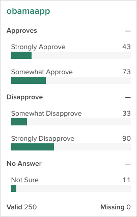

[Previous: exporting data](export.html)
```{r load data, include=FALSE}
## Because the vignette tasks require communicating with a remote host,
## we do all the work ahead of time and save a workspace, which we load here.
## We'll then reference saved objects in that as if we had just retrieved them
## from the server
library(crunch)
load("vignettes.RData")
options(width=120)
```

A common task in the market research world is to collapse two or more categories together to see how the collapsed categories compare to one another. For example, if you asked people to rate their preference on a scale of 1 to 10, you might want to see how the people who provide a rating between 1 and 5 compare to those who rated it between 6 and 10. This goes by a number of names, including "_Top Box_" or "_Nets_", depending on the use case. In Crunch, we call this family of features _Subtotals_. This vignette shows how to define, manage, and analyze variables with subtotals.

# Getting and setting subtotals

Subtotals can be applied to any Categorical or Categorical Array variable. In R, we can view and set subtotal definitions with the `subtotals()` function. If there are no subtotals, the function will return `NULL`:

```{r no subtotals, eval=FALSE}
subtotals(ds$obamaapp)
```
```{r no subtotals print, echo = FALSE}
sub_initial_subtotals
```

To add subtotals, we can assign a list of `Subtotal` objects. Each `Subtotal` object has three things: a `name` to identify it; a set of `categories` to pool together, referenced either by category name or id; and a location to show it, either `after` a given category or with `position="top"` or `"bottom"` to pin it first or last in the list.

```{r add some subtotals, eval = FALSE}
subtotals(ds$DiversityImportant) <- list(
    Subtotal(name = "Follows closely",
             categories = c("Strongly closely", "Very closely"),
             after = "Somewhat closely"),
    Subtotal(name = "Generally disagree",
             categories = c("Not very closely", "Not at all"),
             after = "Not at all")
)
```

Now, if we check `subtotals()`, we can see that we have saved them. In this output we see a few different aspects of subtotals: the `anchor` is the id of the category to put the subtotal after (matching the `after` or `position` argument in `Subtotal()`), name, aggregation functions and `args`, which in the this case are the category ids to include in the subtotal.

```{r new subtotals, eval = FALSE}
subtotals(ds$manningknowledge)
```
```{r, echo = FALSE}
sub_subtotals1
```

This shows up in the Categorical variable card on the web app like this:

```{r crunch app output, echo = FALSE}
knitr::include_graphics("images/manning_knowledge_subtotals.png")

```

We can also add _headings_, which are similar to subtotals in that they are additions to categorical variables that will be displayed in the app, but they don't sum up any categories. For a variable with many categories, they can help group variables visually. Here we add some guides to Obama's approval rating.

```{r add some headings, eval = FALSE}
subtotals(ds$obamaapp) <- list(
    Heading(name = "Approves",
            after = 0),
    Heading(name = "Disapprove",
            after = "Somewhat Approve"),
    Heading(name = "No Answer",
            after = "Strongly Disapprove")
)

subtotals(ds$obamaapp)
```
```{r headings out, echo = FALSE}
sub_headings
```

Again, this shows up in the Categorical variable card on the web app:

```{r crunch app output headings, echo = FALSE}


```

# Removing subtotals

Subtotals and headings can be removed by assigning a `NULL` value.

```{r remove some headings, eval = FALSE}
subtotals(ds$YearsCodedJob) <- NULL
```
```{r remove headings out, echo = FALSE}
sub_initial_subtotals
```

# Setting many subtotals

In the _Economist_ survey, there are a number of questions that have the same response categories. If the category names (or ids, if we're using those) are the same, we can use the same set of subtotals across multiple variables.

```{r save some subtotals, eval = FALSE}
approve_subtotals <- list(
    Subtotal(name = "Approves",
            categories = c("Somewhat approve", "Strongly approve"),
            after = "Somewhat approve"),
    Subtotal(name = "Disapprove",
            categories = c("Somewhat disapprove", "Strongly disapprove"),
            after = "Strongly disapprove"))
```

```{r check some categories, eval = FALSE}
subtotals(ds$snowdenleakapp) <- approve_subtotals
subtotals(ds$congapp) <- approve_subtotals
```

Notice here, because each of the categories for these variables has slightly different ids, the `args` in the output differs slightly. But, because we used category names when we were constructing our list of subtotals, when we store them on the variable itself, Crunch does the right thing and converts them over to the correct ids.

```{r show some categories, eval = FALSE}
subtotals(ds$snowdenleakapp)
subtotals(ds$congapp)
```
```{r show categories out, echo = FALSE}
sub_snowdon
sub_con
```


# Computing with subtotals

Now that we have defined subtotals on the congressional approval question, if we use it in a crosstab, we can see the subtotals.

```{r show subtotals, eval= FALSE}
crtabs(~congapp + gender, data = ds)
```
```{r show subtotals out, echo = FALSE}
sub_crtab
```

We can even get just the subtotals as an array from the result if we want to ignore the constituent groups:

```{r show subtotals only, eval = FALSE}
subtotalArray(crtabs(~congapp + gender, data = ds))
```
```{r show subtotals only out, echo = FALSE}
subtotalArray(sub_crtab)
```

If you don't want to see the subtotals as part of these summaries, you can suppress them from display with the `noTransforms()` function around `crtabs()`.

```{r noTransforms, eval = FALSE}
noTransforms(crtabs(~congapp + gender, data = ds))
```
```{r, echo = FALSE}
noTransforms(sub_crtab)
```

This does not modify the variable---the subtotals are still defined and visible in the web app---but they are removed from the current analysis.

[Next: Crunch internals](crunch-internals.html)
